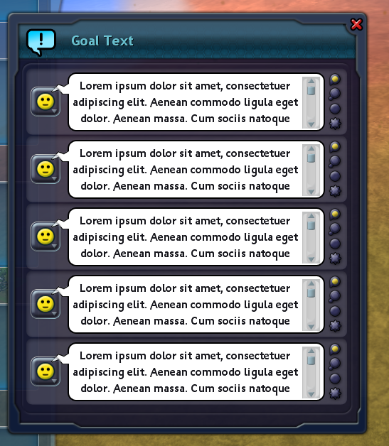

# Adventure Text Limit Break
 This mod disables all text limitations on text edit fields found in Spore's Adventure Editor, allowing you to be as verbose as you want to be. It does not extend the amount of text bubbles total in each act, goal and creation, but at least now you will no longer be restricted by the 192 character limit imposed on you previously.

### Latest release can be found [here](https://github.com/Liskomato/Spore-AdventureTextLimitBreak/releases/latest).

 

 If you encounter any issues, please don't hesitate to contact me about this! 

 ### **Requires [Spore ModAPI Launcher Kit](http://davoonline.com/sporemodder/rob55rod/ModAPI/Public/).**

## FAQ
### Is this shareable?
Yes, it is indeed a shareable adventure mod. In fact, one of my previous mods, [Adventure Localizer](https://github.com/Liskomato/Spore-AdventureLocalizer), proved that text strings exceeding 192 characters were possible to share online to Spore.com, discounting some small hiccups with the sharing process itself. The Localizer mod was how I managed personally to share adventures with overlong text before I made this mod, but now some of the long process that was previously there (in editing text fields manually outside of Spore itself) can now be skipped entirely.

### What happens if I remove the mod and loaded an adventure where I used this mod?
Same thing if you were to use the Localizer before for this purpose: The text itself will cease to exist if you try to edit it, but it will persist in the adventure's data itself for as long as it is unmodified. For this reason, the adventures now made with this are entirely shareable, and if you have used the Localizer before, *now you can actually display your long text strings in-game.*

### Anything else I should take note of?
Recently when I was sharing three of my adventures utilizing overlong text, two of them couldn't be shared until I removed thumbnails for one adventure, and trimmed the previous intro/win/lose texts to less than 192 characters. If you encounter any issues with sharing your own adventures, try doing the same things I did until they comply to share. Or, if you know how to use SporeModder FX, try compressing your PNG thumbnails with a compression algorithm like [zopfli](https://github.com/google/zopfli), and manually place them again into your EditorSaves package.

 ## Credits
 - Liskomato - Main developer 
